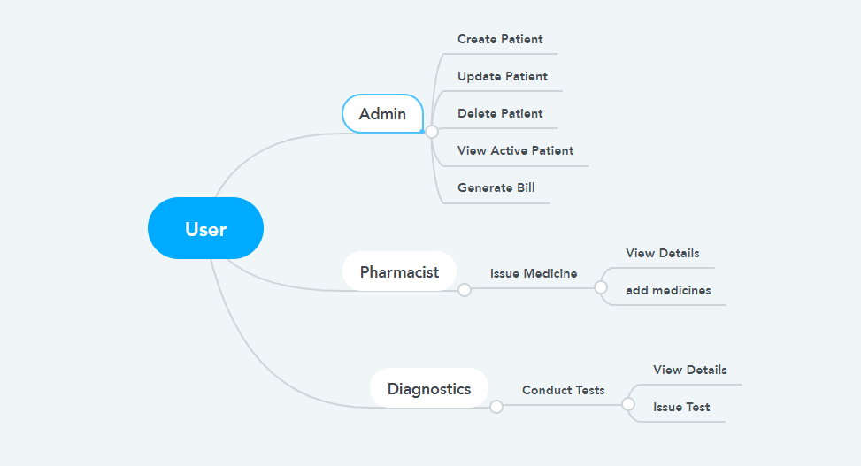

# Hospital Management System

## Users and Their Operations

## Guidelines to test our code:
1. Clone the repo.
2. Go to pgadmin4 and make a db with name testing.
3. Navigate to __init__.py file and change the ** inside SQLDATABASE_URL with you pgadmin4 password.
4. Then, go to your cmd and activate Virtual Environment
5. Run command:- flask init_db
6. Start your server using:  flask run
7. Login credentials are:
    -a. Username: RE16153100 Password: casestudy@12
    -b. Username: PS16153100 Password: 12345
    -c. Username: DS16153100 Password: 12345

* Note: Suggestions are Welcome :)  *

* [Our App](http://alokmishra.pythonanywhere.com/)